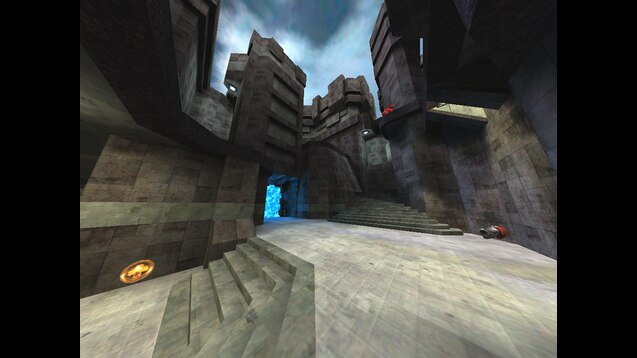
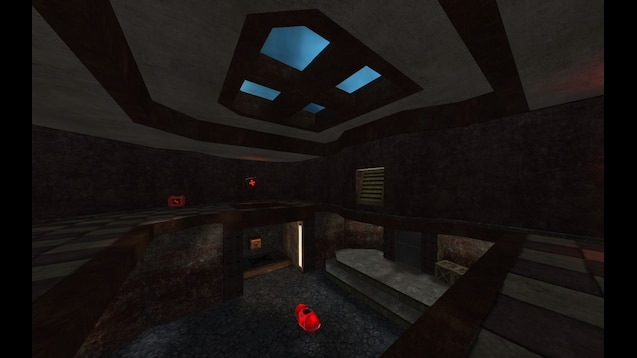
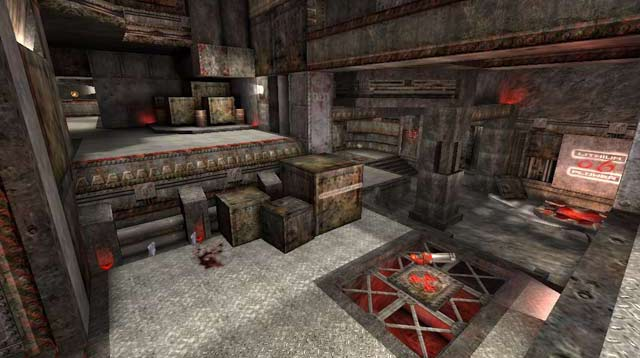
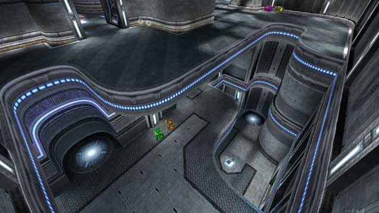
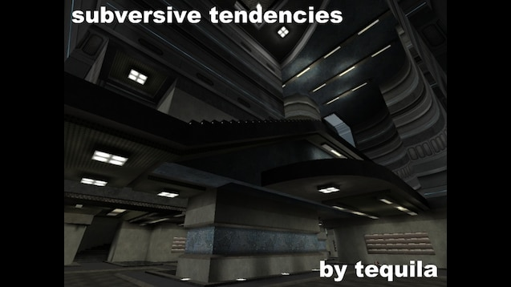
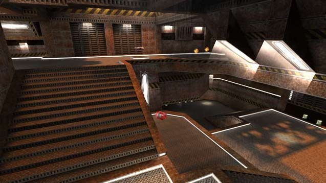

# Fresh duel maps

A set of fresh maps. Use in conjunction with the [duel](https://github.com/quakelive-server-standards/quakelive-server-standards/tree/master/workshop/evolved/duel) workshop item list.

## Based on file

None.

## Version 1

### Added maps

#### Aggressor

Workshop id: [569873334](https://github.com/quakelive-server-standards/quakelive-server-standards/tree/master/workshop/evolved/duel#569873334)

#### Bastet

Workshop id: [2099209867](https://github.com/quakelive-server-standards/quakelive-server-standards/tree/master/workshop/evolved/duel#2099209867)

#### Beatbox

Workshop id: [547937675](https://github.com/quakelive-server-standards/quakelive-server-standards/tree/master/workshop/evolved/duel#547937675)

#### Blood Covenant

Workshop id: [1691279416](https://github.com/quakelive-server-standards/quakelive-server-standards/tree/master/workshop/evolved/duel#1691279416)

#### Blood Run Tribute

Workshop id: [2310495629](https://github.com/quakelive-server-standards/quakelive-server-standards/tree/master/workshop/evolved/duel#2310495629)

#### Blue Monk

Workshop id: [2351045272](https://github.com/quakelive-server-standards/quakelive-server-standards/tree/master/workshop/evolved/duel#2351045272)

#### Cage

Workshop id: [540937824](https://github.com/quakelive-server-standards/quakelive-server-standards/tree/master/workshop/evolved/duel#540937824)

#### Catharsis (Alpha 1)

Workshop id: [1209601964](https://github.com/quakelive-server-standards/quakelive-server-standards/tree/master/workshop/evolved/duel#1209601964)

#### 5quid

Workshop id: [1827809205](https://github.com/quakelive-server-standards/quakelive-server-standards/tree/master/workshop/evolved/duel#1827809205)

#### Diabotical: Frontier

Workshop id: [2056321023](https://github.com/quakelive-server-standards/quakelive-server-standards/tree/master/workshop/evolved/duel#2056321023)

#### Eldister

Workshop id: [2020820722](https://github.com/quakelive-server-standards/quakelive-server-standards/tree/master/workshop/evolved/duel#2020820722)

#### Earth Core Program

Workshop id: [579717457](https://github.com/quakelive-server-standards/quakelive-server-standards/tree/master/workshop/evolved/duel#579717457)

#### Imaginations from the other side

Workshop id: [2439697217](https://github.com/quakelive-server-standards/quakelive-server-standards/tree/master/workshop/evolved/duel#2439697217)

#### Stranglehold

Workshop id: [1706214273](https://github.com/quakelive-server-standards/quakelive-server-standards/tree/master/workshop/evolved/duel#1706214273)

#### Kamasutra

Workshop id: [856142431](https://github.com/quakelive-server-standards/quakelive-server-standards/tree/master/workshop/evolved/duel#856142431)

#### Khaooohs

Workshop id: [863262235](https://github.com/quakelive-server-standards/quakelive-server-standards/tree/master/workshop/evolved/duel#863262235)

#### megadm4_09

Workshop id: [579717457](https://github.com/quakelive-server-standards/quakelive-server-standards/tree/master/workshop/evolved/duel#579717457)

#### Monsoon

Workshop id: [542684362](https://github.com/quakelive-server-standards/quakelive-server-standards/tree/master/workshop/evolved/duel#542684362)

#### Never Enough

Workshop id: [579717457](https://github.com/quakelive-server-standards/quakelive-server-standards/tree/master/workshop/evolved/duel#579717457)

#### Story to tell

Workshop id: [579717457](https://github.com/quakelive-server-standards/quakelive-server-standards/tree/master/workshop/evolved/duel#579717457)

#### Nemesis

Workshop id: [774562650](https://github.com/quakelive-server-standards/quakelive-server-standards/tree/master/workshop/evolved/duel#774562650)

#### The Chastity Belt Duel

Workshop id: [579717457](https://github.com/quakelive-server-standards/quakelive-server-standards/tree/master/workshop/evolved/duel#579717457)

#### Aero Blood Run

Workshop id: [2009762538](https://github.com/quakelive-server-standards/quakelive-server-standards/tree/master/workshop/evolved/duel#2009762538)

#### Harder Than Hate

Workshop id: [2089014512](https://github.com/quakelive-server-standards/quakelive-server-standards/tree/master/workshop/evolved/duel#2089014512)

#### Placebo Effect

Workshop id: [641459594](https://github.com/quakelive-server-standards/quakelive-server-standards/tree/master/workshop/evolved/duel#641459594)

#### The Proving Grounds II

Workshop id: [821675354](https://github.com/quakelive-server-standards/quakelive-server-standards/tree/master/workshop/evolved/duel#821675354)

#### Lithium Flower ver.2

Workshop id: [579717457](https://github.com/quakelive-server-standards/quakelive-server-standards/tree/master/workshop/evolved/duel#579717457)

#### Proving Grounds

Workshop id: [579717457](https://github.com/quakelive-server-standards/quakelive-server-standards/tree/master/workshop/evolved/duel#579717457)

#### Still Alive

Workshop id: [579717457](https://github.com/quakelive-server-standards/quakelive-server-standards/tree/master/workshop/evolved/duel#579717457)

#### Last Trip

Workshop id: [579717457](https://github.com/quakelive-server-standards/quakelive-server-standards/tree/master/workshop/evolved/duel#579717457)

#### KARIN

Workshop id: [579717457](https://github.com/quakelive-server-standards/quakelive-server-standards/tree/master/workshop/evolved/duel#579717457)

#### Kora

Workshop id: [583405286](https://github.com/quakelive-server-standards/quakelive-server-standards/tree/master/workshop/evolved/duel#583405286)

#### Adelline

Workshop id: [579717457](https://github.com/quakelive-server-standards/quakelive-server-standards/tree/master/workshop/evolved/duel#579717457)

#### Saint Tourney 1

Workshop id: [1693961293](https://github.com/quakelive-server-standards/quakelive-server-standards/tree/master/workshop/evolved/duel#1693961293)

#### Si'Metrik

Workshop id: [2047343265](https://github.com/quakelive-server-standards/quakelive-server-standards/tree/master/workshop/evolved/duel#2047343265)

#### Sinister (2012)

Workshop id: [648343575](https://github.com/quakelive-server-standards/quakelive-server-standards/tree/master/workshop/evolved/duel#648343575)

#### Swift

Workshop id: [2351050532](https://github.com/quakelive-server-standards/quakelive-server-standards/tree/master/workshop/evolved/duel#2351050532)

#### Subversive Tendencies

Workshop id: [1706161905](https://github.com/quakelive-server-standards/quakelive-server-standards/tree/master/workshop/evolved/duel#1706161905)

#### The Rage

Workshop id: [563655427](https://github.com/quakelive-server-standards/quakelive-server-standards/tree/master/workshop/evolved/duel#563655427)

#### Totally Lost

Workshop id: [822833735](https://github.com/quakelive-server-standards/quakelive-server-standards/tree/master/workshop/evolved/duel#822833735)

#### Reloaded

Workshop id: [571945871](https://github.com/quakelive-server-standards/quakelive-server-standards/tree/master/workshop/evolved/duel#571945871)
