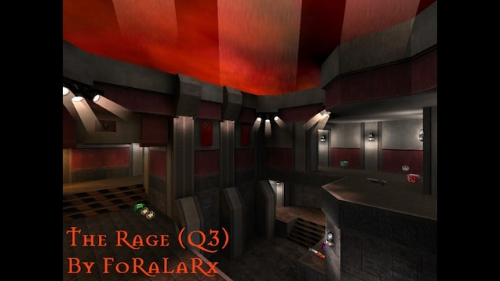
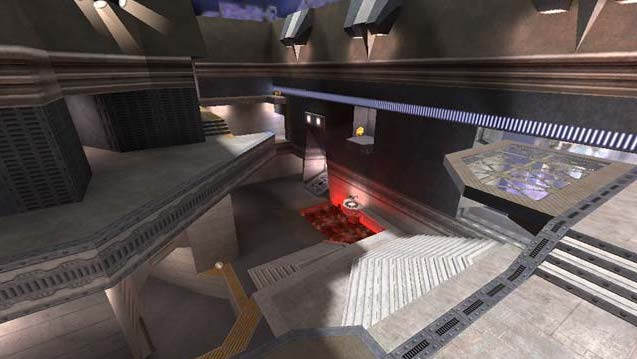
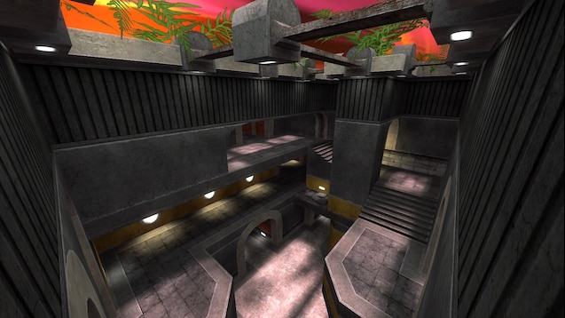
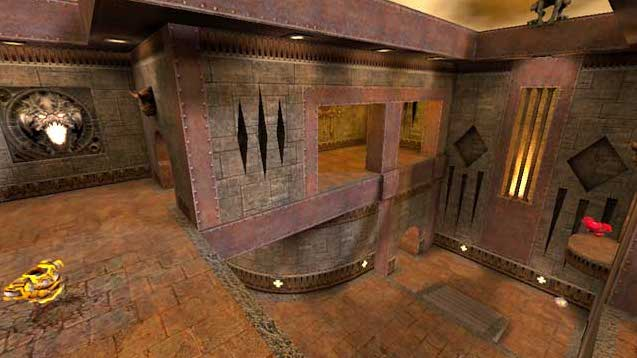
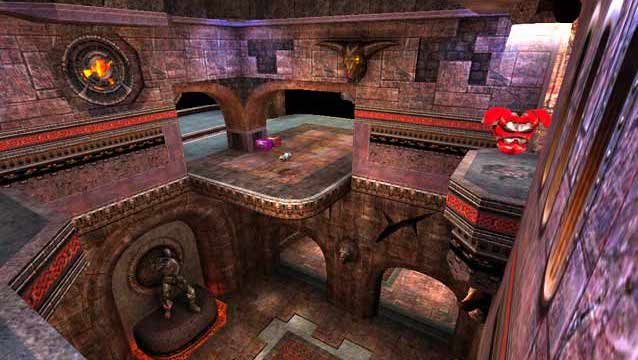
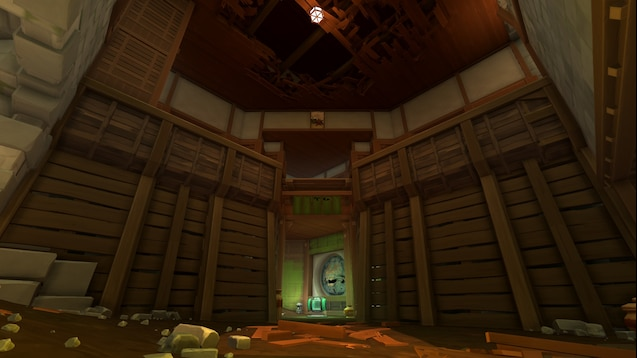
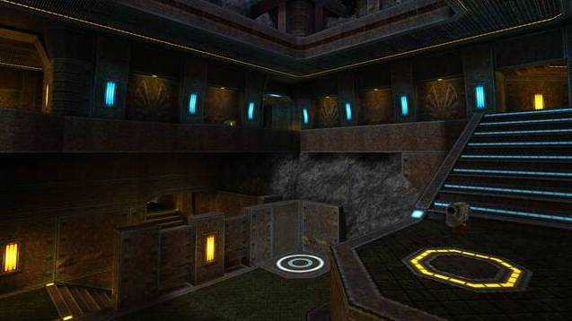

# Fresh duel maps

## Based on file

None.

## Maps

### The Rage

`therage` - The Rage is a remake of ztn2dm3, which is a map that was made by Sten "ztn" Uusvali for Q2.

It looked interesting.

https://steamcommunity.com/sharedfiles/filedetails/?id=563655427
http://ws.q3df.org/map/fora_rage/  
https://lvlworld.com/overview/id:1955

### Aggressor

`aggressor` - 

It looked interesting.

https://steamcommunity.com/sharedfiles/filedetails/?id=569873334  
http://ws.q3df.org/map/aggressor  

### Cage

`edge` - 

It looked interesting.

https://steamcommunity.com/sharedfiles/filedetails/?id=540937824

### Imaginations from the other side

`gmdm3` - A ported version of the quake 1 map 'Imaginations from the other side' (gomdm3).

https://steamcommunity.com/sharedfiles/filedetails/?id=2439697217  

### Bastet

`bastet` - Small/Mid sized duel map.

It looked interesting.

https://steamcommunity.com/sharedfiles/filedetails/?id=2099209867  

### Harder Than Hate

`pjw3tourney2` - 

It looked interesting.

https://steamcommunity.com/sharedfiles/filedetails/?id=2089014512  
http://ws.q3df.org/map/pjw3tourney2/  
https://lvlworld.com/overview/id:1275  

### Si'Metrik

`simetrik` - A temple floating in the sky above an archipelago of islands.

It looked interesting.

https://steamcommunity.com/sharedfiles/filedetails/?id=2047343265  
http://ws.q3df.org/map/simetrik/  
https://lvlworld.com/overview/id:607  

### Aero Blood Run

`oxodm2` - 

It looked interesting.

https://steamcommunity.com/sharedfiles/filedetails/?id=2009762538  
http://ws.q3df.org/map/oxodm2/  
https://lvlworld.com/overview/id:2229  

### 5quid

`charon3dm13` - 

It looked interesting.

https://steamcommunity.com/sharedfiles/filedetails/?id=1827809205  
https://ws.q3df.org/map/charon3dm13/  
https://lvlworld.com/overview/id:1606  

### Subversive Tendencies

`teqtrny3` -

It looked interesting.

https://steamcommunity.com/sharedfiles/filedetails/?id=1706161905  
https://ws.q3df.org/map/teqtrny3/  
https://lvlworld.com/overview/id:944  

### Catharsis (Alpha 1)

`catharsis_a1` - Small-to-medium sized duel-oriented arena, based on an Warsow map.

It looked interesting.

https://steamcommunity.com/sharedfiles/filedetails/?id=1209601964  

### Khaooohs

4.1 out of 5 (146 votes)

`kaos` - An impressive map that blends a little of the tech textures with the gothic textures really well.

It looked interesting.

https://steamcommunity.com/sharedfiles/filedetails/?id=863262235  
http://en.ws.q3df.org/map/kaos/  
https://lvlworld.com/overview/id:49  

### Nemesis

`nemisis` - The Map has its unique style with lots of cool angles and jumps.

It looked interesting.

https://steamcommunity.com/sharedfiles/filedetails/?id=774562650  

### Kamasutra

`kamasutra` - 

It looked interesting.

https://steamcommunity.com/sharedfiles/filedetails/?id=856142431  
https://ws.q3df.org/map/pukka3tourney6/  
https://lvlworld.com/overview/id:2058  

### Reloaded

`yog3dm2` - A very Quake2 DM styled map with great connectivity, texturing and lighting.

It looked interesting.

https://steamcommunity.com/sharedfiles/filedetails/?id=571945871  
https://ws.q3df.org/map/yog3dm2/  
https://lvlworld.com/overview/id:585  

### Stranglehold

`jaxtourney1` - This is one small map with a lot going for it.

It looked interesting.

https://steamcommunity.com/sharedfiles/filedetails/?id=1706214273
https://ws.q3df.org/map/jaxtourney1/  
https://lvlworld.com/overview/id:1160  

### Saint Tourney 1

`sainttourney1` - This is a single arena area constructed on two levels.

It looked interesting.

https://steamcommunity.com/sharedfiles/filedetails/?id=1693961293  
https://ws.q3df.org/map/sainttourney1/  
https://lvlworld.com/overview/id:1693  

### Still Alive

`reqtourney1` - Still Alive by Requiem is a map that is focused on promode gameplay.

It looked interesting.

https://steamcommunity.com/sharedfiles/filedetails/?id=579717457 - Map number 20  
https://ws.q3df.org/map/reqtourney1/  
https://lvlworld.com/media/id:2009  

### Swift

`swift` - 

It looked interesting.

https://steamcommunity.com/sharedfiles/filedetails/?id=2351050532  

### Blue Monk

`bluemonk` - 

It looked interesting.

https://steamcommunity.com/sharedfiles/filedetails/?id=2351045272  

### Blood Run Tribute

`bloodruntribute` - 

It looked interesting.

https://steamcommunity.com/sharedfiles/filedetails/?id=2310495629  
https://ws.q3df.org/map/obs3dm2/  
https://lvlworld.com/overview/id:2028  

### Diabotical: Frontier

`dbtfrontier` - 

It looked interesting.

https://steamcommunity.com/sharedfiles/filedetails/?id=2056321023  

### Earth Core Program

`fjo3tourney1` - 

It looked interesting.

https://steamcommunity.com/sharedfiles/filedetails/?id=579717457 - Map number 8  
https://lvlworld.com/overview/id:2425  
https://lvlworld.com/liveView/overview/2425  

### megadm4_09

`megadm4_09` -

It looked interesting.

https://steamcommunity.com/sharedfiles/filedetails/?id=579717457 - Map number 9  
https://www.youtube.com/watch?v=yl69wqaIbaM  

### Story to tell

`necro6` - 

It looked interesting.

https://steamcommunity.com/sharedfiles/filedetails/?id=579717457 - Map number 10  
https://ws.q3df.org/map/necro6/  
https://lvlworld.com/overview/id:1832  

### Never Enough

`ne_duel` - 

It looked interesting.

https://steamcommunity.com/sharedfiles/filedetails/?id=579717457 - Map number 11  
https://ws.q3df.org/map/ne_duel/  
https://lvlworld.com/overview/id:1613  

### Lithium Flower ver.2

`q3nem06_v2` - 

It looked interesting.

https://steamcommunity.com/sharedfiles/filedetails/?id=579717457 - Map number 18  
http://ws.q3df.org/map/q3nem06_v2/  
https://lvlworld.com/overview/id:1904  

### Last Trip

`rota3dm1` - Last Trip by Rota is a large and very vertical map.

https://steamcommunity.com/sharedfiles/filedetails/?id=579717457 - Map number 21  
https://ws.q3df.org/map/rota3dm1/  
https://lvlworld.com/overview/id:1913  

### KARIN

4.4 out of 5 (41 votes)

`rota3dm2` -

It looked interesting.

https://steamcommunity.com/sharedfiles/filedetails/?id=579717457 - Map number 22  
https://ws.q3df.org/map/rota3dm2/  
https://lvlworld.com/overview/id:1941  

### Kora

`rota3dm5` - 

It looked interesting.

https://steamcommunity.com/sharedfiles/filedetails/?id=583405286  
https://ws.q3df.org/map/rota3dm5/  
https://lvlworld.com/overview/id:2306  

### Adelline

`rota3tourney1` -

It looked interesting.

https://steamcommunity.com/sharedfiles/filedetails/?id=579717457 - Map number 23  
https://ws.q3df.org/map/rota3tourney1/  
https://lvlworld.com/overview/id:2041  
