# Steam Workshop duel maps

### Monsoon

"Lukin's Monsoon (xtn remix) ported to the new version of ql, still a few texture bugs but much better compared to the previous version. PLAY IT WITH RAMPJUMP AND CROUCHSLIDE ENABLED :)" Steam

https://steamcommunity.com/sharedfiles/filedetails/?id=542684362  
http://ws.q3df.org/map/monsoon/  

### Beatbox

lvlworld: 4.1 out of 5 (243 votes)

"A good solid map that keeps you on your toes. Not sure about the flame lights mixed with tech lighting, just doesn't seem right to me. The texturing is very rich and mixed, almost over done and cluttered. The gameflow is good and leads to some vertical action. I don't know how ztn does it, I was expecting to be a bit bored with this map, but I wasn't. The texturing and lighting is an odd mix of gothic and tech which does not seem quite right (almost confused), however its well worth the d/load." lvlworld

https://steamcommunity.com/sharedfiles/filedetails/?id=547937675  
http://ws.q3df.org/map/ztn3dm2/  
https://lvlworld.com/review/id:107  
LiveView: https://lvlworld.com/liveView/media/107  

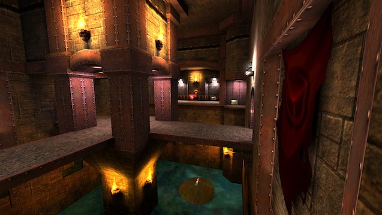

### The Proving Grounds II

The Proving Grounds II (pro-q3tourney2) - converted, remixed and optimized for Quake Live.

https://steamcommunity.com/sharedfiles/filedetails/?id=821675354  
http://ws.q3df.org/map/pro-q3tourney2/  

### Blood Covenant

Steam: 4 out of 5 (81 votes)  
Steam: 4 out of 5 (44 votes)  

"QC map ported to QL with some additional fixes, and more fixes." Steam

https://steamcommunity.com/sharedfiles/filedetails/?id=1403618971  
https://steamcommunity.com/sharedfiles/filedetails/?id=1691279416  
http://ws.q3df.org/map/blood_covenant/  
http://ws.q3df.org/map/bloodcovenant/  

### Eldister

"Eldister - remake of 'Elder' with 'Sinister' theme.
Fully rebuild from scratch (brushwork, texturing, clipping, lighting and VIS).

Mix:
This mix contains a new jump pad, new teleporter, more ways for escaping and other modified stuff.
There is a little secret you can find only in FFA." Steam

https://steamcommunity.com/sharedfiles/filedetails/?id=2020820722  

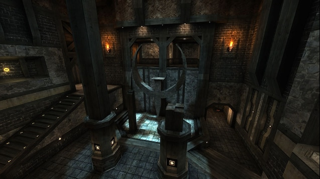

### Totally Lost

"Totally Lost (pro-nodm9) - converted from Q3A and optimized for Quake Live.

This map was created by Rich 'swelt' Jacques and Jakab 'Rasputin' Marton in 2003." Steam

https://steamcommunity.com/sharedfiles/filedetails/?id=822833735  
http://ws.q3df.org/map/nodm9/  

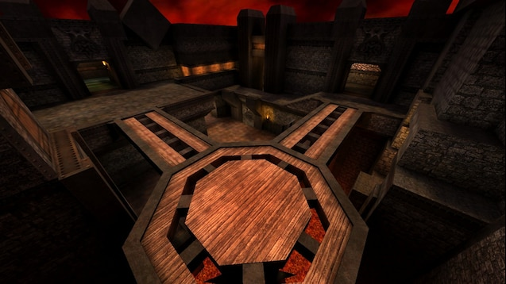

### The Rage

4.3 out of 5 (25 votes)

"The Rage is a remake of ztn2dm3, which is a map that was made by Sten "ztn" Uusvali for Q2. There has been a lot of remake maps that have been made over the years, and when I saw this one being made I went a bit crazy at playing it over and over as I've played the original a ridiculous amount of times.
The gameplay in Q3 on the map really makes the map shine. A lot more can be done on this version for Q3 then what could ever be done in Q2, especially when it comes to playing against bots.
The layout is purely matched, yet the weapon and item layout have been changed in ways, though pulled off very tasteful. There are a few spots that give the abilities to double jump with promode enabled in OSP/CPMA up to the RG, to the RL, or across from the RL to the PG. The map has vQ3 written all over it though also, as I can truthfully see this becoming a big map for online gameplay for everyone.
The last and greatest part of the map is that it comes in two flavors!! The first version of the map has been done using the EQ2 textures from evillair, and it gives it a real strogg Q2 feel that the original never possessed. The second version is a straight Q3 styled and textured looking map. The two different version are essentially the same map, but have different textures and different item and weapon layouts from each other. The EQ2 version has a GA for promode gameplay. They're both equally fun to play, and you can hear the tones of the strogg sound from Q2 bellowing in the background of them which is great!" lvlworld

https://steamcommunity.com/sharedfiles/filedetails/?id=563655427  
http://ws.q3df.org/map/fora_rage/  
https://lvlworld.com/comments/id:1955  
Live View: https://lvlworld.com/liveView/media/1955  

### Aggressor

"All Credits go to Tyrann who created the remake for Quake 3 and Yves Allaire aka evil lair for his texture set. I made reconversion to QL" Steam

https://steamcommunity.com/sharedfiles/filedetails/?id=569873334  
http://ws.q3df.org/map/aggressor  

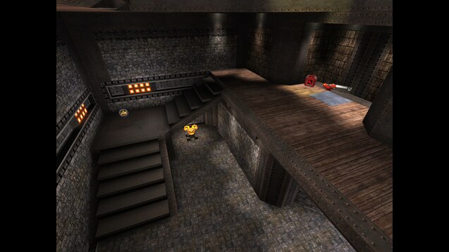

### Cage

https://steamcommunity.com/sharedfiles/filedetails/?id=540937824  

### Sinister (2012)

"The first version of "Sinister" out of 2012 (Premium pak 14)." Steam

https://steamcommunity.com/sharedfiles/filedetails/?id=648343575  

### gomdm3

"A ported version of the quake 1 map 'Imaginations from the other side' (gomdm3)" Steam

https://steamcommunity.com/sharedfiles/filedetails/?id=2439697217  

### Bastet

"There is no shrine,
no trace of temple rites,
but, stained with tawny red and gold,
Bastet remains,
on crumbling walls in Nefertari's tomb. 

Small/Mid sized duel map.
Might still be a couple things to tweak.
Enjoy"

https://steamcommunity.com/sharedfiles/filedetails/?id=2099209867  

### Harder Than Hate

lvlworld: 3.7 out of 5 (18 votes)

"pjw takes his first serious stab at making a competitive level, and he has done a rather remarkable job. The map is visually sound throughout, although it is not strongly themed like his other arenas. The connectivity is strongly enhanced with Promode enabled but is still very good with standard Quake 3 physics. The item placement is rather interesting and features a Green Armour. The distribution of the items is well thought out, but almost all of the items are running on custom respawn values. The weapons have been wisely given 15 second respawn times to prevent players from focusing entirely on holding the armour and health, and the 30 second health ball and ammo clip respawns do not matter much. The main concern lies in the armour respawn time of 60 seconds, which concerns serious players hoping to use the map for regular Quake 3. CPMA overrides respawn values automatically, but regular Quake 3, OSP, and OSP Promode do not, so some players may be disappointed in that there simply is not enough armour available. A FFA version of the map, pjw3tourney2f, is also available and introduces a Quad Damage while removing the Green Armour." lvlworld

https://steamcommunity.com/sharedfiles/filedetails/?id=2089014512  
http://ws.q3df.org/map/pjw3tourney2/  
https://lvlworld.com/review/id:1275  
Live View: https://lvlworld.com/liveView/review/1275  

### Si'Metrik

4.1 out of 5 (177 votes)

"A temple floating in the sky above an archipelago of islands. The custom sky box is gorgeous jumping down towards an almost full screen of turquoise sea is quite sublime. The temple architecture is well executed, texturing and lighting are spot on. The layout works really well, the connectivity is excellent and the gameplay great. It all comes together to create a smooth environment that really makes you want to play. Custom sounds further enhance the atmosphere. The death sound with the splash is very nice and subtle. There is only one or two spots where the r_speeds are borderline, nothing at all to worry about. Bots play fine and cover most of the map, they just miss out on the Medkit and the other secret area." lvlworld

https://steamcommunity.com/sharedfiles/filedetails/?id=2047343265  
http://ws.q3df.org/map/simetrik/  
https://lvlworld.com/review/id:607  
Live View: https://lvlworld.com/liveView/review/607  

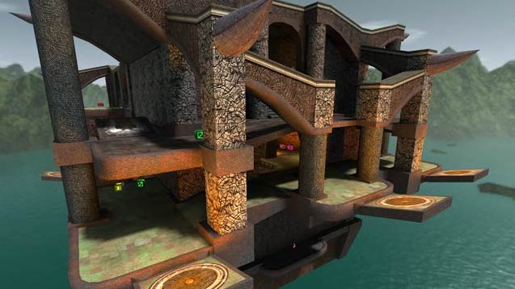

### Aero Blood Run

3.7 out of 5 (8 votes)

"This release falls in to the why do it category. It is a conversion of ztn's Quake classic Blood Run, which ztn has already converted to Q3A! In fact there are two versions by ztn, a standard and Tourney release.
This conversion brings a few changes to Blood Run. A strange sense of scale, Red Armour now has a second access point and teleporters replace steps all over the place. The reason for the steps to teleport switch appears to be due to scaling and build." lvlworld

https://steamcommunity.com/sharedfiles/filedetails/?id=2009762538  
http://ws.q3df.org/map/oxodm2/  
https://lvlworld.com/review/id:2229  
Live View: https://lvlworld.com/liveView/review/2229  

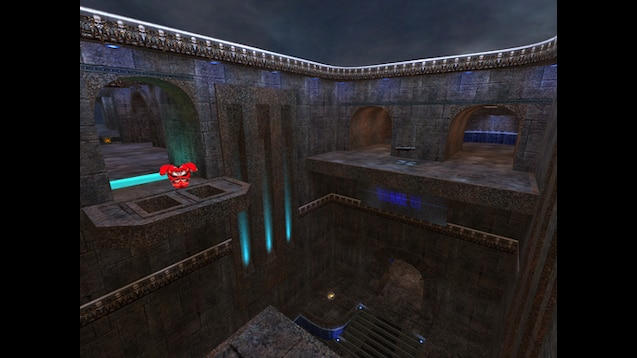

### 5quid

4.1 out of 5 (39 votes)

"Ah yes, another architectural masterpiece from Charon. Construction is similar to Flea Fights as far as textures are concerned. Nice use of Lunaran textures here and there. The layout allows for fluid and furious game play.
Item placement is very plentiful, keeping some of the more valuable items within a jumping reach. Not so close as to make getting them easily while taking fire from your opponents.
Gameplay is omni-directional as you move vertically as easily as you can shred horizontally. I have all of Charon's maps. I have to admit I am a collector and when I found out that he had released this baby, I was all over it.
If you want hard-core matches, I suggest you download this like you have never downloaded before." lvlworld

https://steamcommunity.com/sharedfiles/filedetails/?id=1827809205  
https://ws.q3df.org/map/charon3dm13/  
https://lvlworld.com/review/id:1606  
Live View: https://lvlworld.com/liveView/review/1606  

### Subversive Tendencies

3.9 out of 5 (24 votes)

"This is one sweet map. Every aspect is working well, it looks great and game play is smooth. Clean concrete and steel textures have been used to create a high tech station set amidst an island archipelago. The watery environs visible through the windows. Lighting is fine, nothing too exciting, but no problems either. There is a lot of action in a 4 player FFA. Tourney games are a little slow but some people like them that way. Items are abundant but not excessive, enough to make sure you are never too far from anything. Two minor points would be; the lack of location marks for weapon and Armour respawn points, and the pulsing light on the steps (it gets to be a little too much after a while). Bots play without any problems at all." lvlworld

https://steamcommunity.com/sharedfiles/filedetails/?id=1706161905  
https://ws.q3df.org/map/teqtrny3/  
https://lvlworld.com/review/id:944 
Live View: https://lvlworld.com/liveView/review/944  

### Catharsis (Alpha 1)

"Small-to-medium sized duel-oriented arena, based on an old Warsow map of mine. Armor setup is 1 RA, 1 MH, 1 YA, and 2 GA's. Lacks a railgun. Most notably includes the key and lock mechanic, a really cool concept that I feel deserves some more serious consideration." Steam

https://steamcommunity.com/sharedfiles/filedetails/?id=1209601964  

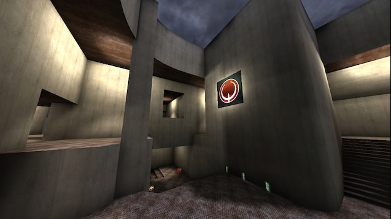

### Khaooohs

4.1 out of 5 (146 votes)

"An impressive map that blends a little of the tech textures with the gothic textures really well - I had quite a few really enjoyable games on this map, one of the reasons why the site missed an update :]"

https://steamcommunity.com/sharedfiles/filedetails/?id=863262235  
http://en.ws.q3df.org/map/kaos/  
https://lvlworld.com/review/id:49  
Live View: https://lvlworld.com/liveView/review/49  

### Nemesis

"The Map has its unique style with lots of cool angles and jumps. Its gotten the Size of Sinister or Furius hights. I thought a lot about Item Placement and Balance aswell. I hope you enjoy :)" Steam

https://steamcommunity.com/sharedfiles/filedetails/?id=774562650  

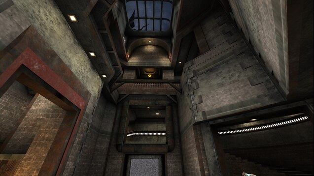

### Kora

4.6 out of 5 (14 votes)

"Welcome back Rota. This release is really great and fun to play. The first thing that impressed me was the visual style. Reminds me of some abandoned industry facility. Dirty metal surfaces and plenty of rusty-brown pieces of steel awakes some kind of good feeling in me.
The layout is not bad at all. Feels like the downstairs area needs more space. Bots almost avoid going down and when they do, only pick up some goodies and return back to top by teleporter.
I like the Railgun being suspended in air and accessible only by a ramppad with a slight risk a few steps below falling down in darkness. The Megahealth provides a solid cure and can really save you from dying. There is no Red Armor, but I must say it's not necessary as there are already two Yellow, one accessible via jumppad, the other in the middle sector. Quad placed on top of bobbing platform support is inconspicuous and it's grabbing can be done while no one is watching you. Good surprise.
It's quite detailed map and running through some sectors that have a long view can push the FPS slightly down. Although this release is outstanding for me and it only waits your download, so don't waste the time :)" lvlworld

https://steamcommunity.com/sharedfiles/filedetails/?id=583405286  
https://ws.q3df.org/map/rota3dm5/  
https://lvlworld.com/review/id:2306  
Live View: https://lvlworld.com/liveView/review/2306  

### Kamasutra

3.9 out of 5 (87 votes)

"Kumasutra is thefury aka sumatra's latest map and in his own words, he was trying to keep it simple, without any distracting gadgets. Well he certainly pulled that off. This map is about game play whilst at the same time, having a level of minimalist yet very appealing textures (according to the readme, he will be releasing these separately later so keep an eye on the author's site for them - see the readme for further details).
When looking at the screen shots the purple sky really seems to clash with the map but in game it works well and besides you hardly notice it once the action gets going. I would probably have not bothered with the plants on this one, but that is a personal observation and some may find the large round lights and teleporters a little off putting, but personally I thought they worked really well with the theme.
The standard map is set up for tourney and DM, but does include a further two map configs (a version for FFA with Quad Damage and a version with Railgun), that can be voted in CPMA.
Load-wise the map includes all the weapons, minus the RG and the BFG. The former of which I thought was a little strange and will not be to some players liking. However, being a fairly open map this is not a bad thing as it does not rapidly descend into a rail slug contest from one end of the map to the other. I found the pre-dominant weapon to be the LG, which was a little strange given the two RL's (one up, one down). Armour wise you'll find an RA, a YA and a GA (on the lower level for CPMA).
The RA is situated in a small stairwell area that was opened up at a later stage in the maps development and the area looks great. The mega-health is also included but campers beware of the player overlooking you with the RL right above your head.
Given the CPMA orientation of the map there is plenty of opportunity to explore the finer art of the greater air control CPMA provides in the pro-mode game play setting. But don't let this put you off because I found most routes where still highly possible in VQ3. You might have to be a bit more experienced to pull some of them off though.
Final Words: A rock solid release from sumatra with awesome game play. Gentlemen start you download engines cause this one is a sure keeper." lvlworld

https://steamcommunity.com/sharedfiles/filedetails/?id=856142431  
https://ws.q3df.org/map/pukka3tourney6/  
https://lvlworld.com/review/id:2058  
Live View: https://lvlworld.com/liveView/review/2058  

### Placebo Effect

https://steamcommunity.com/sharedfiles/filedetails/?id=641459594  

### Reloaded

4 out of 5 (54 votes)

"A very Quake2 DM styled map with great connectivity, texturing and lighting. The aesthetic is concrete and steel bunker with strips of fluro and edge trim lighting. Game flow is enhanced by good item placement. The inclusion of the Quad will remind you that this level is designed for FFA. Frame rate is good, as is Bot play. The Bots cover most of the map but they do seem to like the Yellow armour section and they do not go for the 100h or Quad." lvlworld

https://steamcommunity.com/sharedfiles/filedetails/?id=571945871  
https://ws.q3df.org/map/yog3dm2/  
https://lvlworld.com/review/id:585  
Live View: https://lvlworld.com/liveView/review/585  

### Stranglehold

4 out of 5 (37 votes)

"This is one small map with a lot going for it. The layout wraps around itself quickly, thoroughly well connected with a simple and effective aesthetic. The top floor is where you want to hangout and try to control the level from. This is not as easy as it first looks in games with well matched players. There are a number of jumps that speed up the game play and action, like the one to the Railgun over the central pit. For the best results against bots load up two of them on Nightmare.
Great small map, grab it for sure." lvlworld

http://de.ws.q3df.org/map/jaxtourney1/  
https://ws.q3df.org/map/jaxtourney1/  
https://lvlworld.com/review/id:1160  
Live View: https://lvlworld.com/liveView/review/1160  

### Saint Tourney 1

4.2 out of 5 (16 votes)

"This is a single arena area constructed on two levels. The key to owning this map is control of the upper platform, where the RG and GL are to be found. The rest of the weapons are down below, and health is at a premium, though there is an RA near the Major statue.
The map is mostly textured in id vanilla textures, with a lurid alien world skybox casting a greenish light over everything. Botplay is not bad, but they tend to stay down below (Anarki is the recommended bot for this level) and make fairly easy prey. They don't understand the vertical bouncepad, but make liberal use of the teleporter and occasional use of the bouncepads to the upper area.
A solid, fast-paced map, and good for a few head-to-heads, though a 4-player FFA is fun too." lvlworld

https://steamcommunity.com/sharedfiles/filedetails/?id=1693961293  
https://ws.q3df.org/map/sainttourney1/  
https://lvlworld.com/review/id:1693  
Live View: https://lvlworld.com/liveView/review/1693  

### Still Alive

3.8 out of 5 (29 votes)

"Still Alive by Requiem is a map that is focused on promode gameplay. It's a duel map with vertical action and good connectivity when using double jumping and some ramp jumping in spots.
The layout is pretty impressive how the movement lines up within itself.. shows some skills. The textures he used are from Rorshach's headhunter pack, and a skybox from Jaj. All of the weapons are included, bar the BFG." lvlworld

https://steamcommunity.com/sharedfiles/filedetails/?id=579717457 - Map number 20  
https://ws.q3df.org/map/reqtourney1/  
https://lvlworld.com/media/id:2009  
Live View https://lvlworld.com/liveView/media/2009  

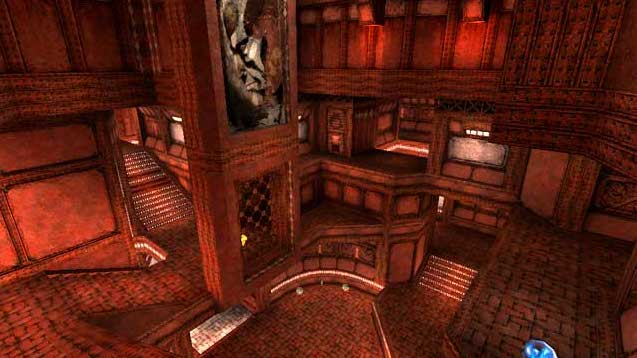

### Swift

https://steamcommunity.com/sharedfiles/filedetails/?id=2351050532  

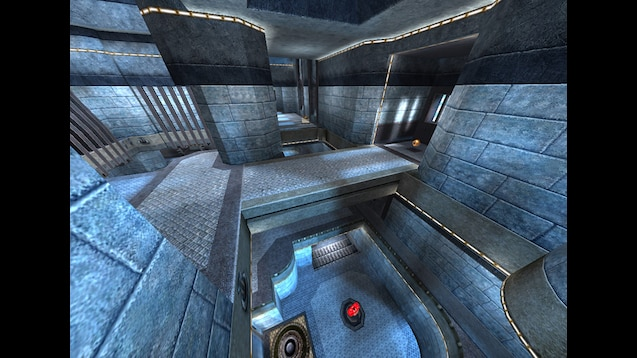

### Blue Monk

https://steamcommunity.com/sharedfiles/filedetails/?id=2351045272  

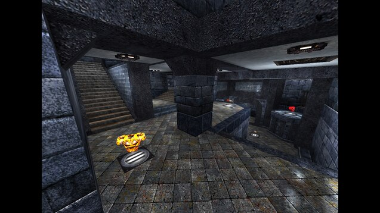

### Blood Run tribute

3.8 out of 5 (28 votes)

"Well, we should not be surprised if somebody is obsessed by Blood Run (pun intended). It is a justly famous deathmatch level by ztn, originally made for classic Quake. Luckily for you (I mean the younger generation) it has been remade for Q3A by its author in two versions, a standard DM and a Tourney, so you can also enjoy its superb gameplay. The question is then: Do we really need another clone or remix of this map? Obviously, the author of the map I am reviewing here answered 'yes' to this question. I am not so sure myself, but would probably say 'no' if pressed for an opinion.
The map is not a straight clone, rather a remix (i.e. similar but not identical). Being a remix is both its strength and weakness.
The weakness is that it is similar but not exactly the same. After you play a few hundred matches on a map, you can switch on the autopilot for navigation and can concentrate on your opponents and on your strategy and tactics instead. Of course the autopilot will fail you in a remix where many things are subtly or significantly different. So for players who intimately know the original playing in a remix is usually a disappointment, my humble self included.
When you change a maps layout, you also change the game flow. For example, replacing with a teleport the direct connection of the spiral stair and jump pad from the quad room down to the main corridor at the base level definitely alters the original game flow. The lighting gun which used to be at the end of the corridor, next to the jump pad attracted players from both directions and made the area one of the focal points for fighting, and an excellent place to set up ambushes. Now it is just another place to quickly pass through. I could list more examples, but I think I have already made my point.
The strength comes from the opportunity to do things in a better way. Every map (even those made by ztn) can be improved. The textures used in this map are a definite improvement over the original. I like Blood Run and played it a lot of times, but the horrible brown-red textures everywhere always made me throw up (not really, but almost). The architecture of the remix is also more detailed than the original and is really very good. Lots of eye candy for those who admire such things. All in all, the map looks much better than the original. Gameplay is smooth, navigating the map is easy.
My only problem with the visual design is the black sky. It just does not fit the map, and at some places makes the lighting appear very unnatural. For example, the open ledge with the plasmagun (over the main atrium) is brightly lit without an apparent light source. Adding a proper sky box would significantly enhance the visuals of the map, would make lighting more natural and would produce lots of dramatic shadows to admire.
In conclusion, this remix of Blood Run is a very nice, professionally constructed level which I can recommend to anyone for download and play. Many will keep it, except maybe diehards who played the original too many times and are not satisfied with anything else. Rating: 8 on the scale of 0 to 10." lvlworld

https://steamcommunity.com/sharedfiles/filedetails/?id=2310495629  
https://ws.q3df.org/map/obs3dm2/  
https://lvlworld.com/review/id:2028  
Live View: https://lvlworld.com/liveView/review/2028  

### Diabotical: Frontier

https://steamcommunity.com/sharedfiles/filedetails/?id=2056321023  

### Earth Core Program

"Earth Core Program is a map that was an entire decade in the making, with Fjoggs having started work in 2004 and coming back to it on-and-off over the years before finally polishing and releasing the final version in 2014. Does it make the cut after all this time?
The texture set is none other than Lunaran's Quake 2-style waste pack and I think it may be one of, if not the best-looking map using it. The geometry is interesting and meshes well with the textures, with lots of great trim work as well as rooftop structures and rocky terrain to give the impression of a much larger environment. The lighting is drop-dead gorgeous too, with amazing contrast between dark and bright areas and absolutely delicious complementary color design schemes with cool, eerie blue lights being set up alongside warm, inviting golden lights. All of this is set beneath a foreboding starry sky by Ikka.
The map's layout is a four-atrium affair with all the classic vertical gameplay goodness players want. There are multiple avenues through which to travel between floors, including stairs, jump pads, and elevators. A relatively wide back passageway connects the center room, the RA room, and a side room with the YA. The item placement is, for the most part, well-balanced, with the RA and MH being placed on opposite ends of the map with plenty of angles to attack from.
Though, if there is one slight disappointment, it's that the lower levels seem pretty bare on weapons and major armor pickups, and going down to the lowest levels for a GA seems kind of risky when there is a YA on a high ledge that potentially lets you keep your height advantage and, even if you get ambushed, gives you a nice wide escape route through the tunnel which then splits off into two other paths. I'd just rather focus on that and the RA / MH that don't require straying too far from the upper levels, instead of putting myself in a bad position for only 25 armor as opposed to 50. Moving one of the more powerful weapons like the LG, which currently sits at one of the highest points in the map - and in the same room as the RA, no less - to one of the bottom areas would help provide more combat incentive down there.
I also ca not help but feel that it is a little on the large side for duel, although a 2v2 TDM I could see working. But then again this map does not support TDM (a common pet peeve of mine - you have nothing to lose from including it, and you will expand your audience), so that's a bummer.
The map plays great with both standard Quake 3 physics as well as CPMA physics, with plenty of angled surfaces to do ramp jumps off of.
Overall a great map that, despite some minor vertical item distribution gripes, demonstrates some fine mapping skills. Well worth the download." lvlworld

https://steamcommunity.com/sharedfiles/filedetails/?id=579717457 - Map number 8  
https://lvlworld.com/review/id:2425  
https://lvlworld.com/liveView/review/2425  

### megadm4_09

https://steamcommunity.com/sharedfiles/filedetails/?id=579717457 - Map number 9  
https://www.youtube.com/watch?v=yl69wqaIbaM  

### Story to tell

4.5 out of 5 (25 votes)

"I've loved Sock's Egyptian texture set since I first laid eyes on it, but Necrosis has done a fine job of constructing it, which includes a fair bit of typical Egyptian style geometry and a pretty detailed brickwork floor. On top of that, you have in depth palm trees, sandy areas, sexy swirling fiery wall lamps, and some nice looking bones of an animal (probably some sort of dinosaur). Lighting is good and bright enough all round, but the light colours emitted from the wall lamps somehow seem a bit too "warming up darkness" considering outside Egyptian areas are normally bright with sunlight. I'd also prefer to see a nice desert skybox instead of id Software's thick yellowy clouds.
Game play is not so bad bearing in mind the size of the map. Weapons have been placed nicely taking into the account the space in which they have to fit in. Snatching the rail gun is not a piece of cake because there is a broken wall on one side of it to pop grenades through. Ammo and health is not over or under done, and that useful armour is included. Power-ups, however, do not make an appearance in this map, but this isn't a bad thing because there really isn't any need (or room) for them. The description in the read-me clearly says "q3 map for tourney", and this is really the only game mode worth playing the map in. You might get away with enjoying a three-way fragfest, but you won't do this map justice if you have many more players. Bots are support, but you are more likely to enjoy human company. CPMA (Challenge ProMode Arena) worked well on this map for me, especially since there are a lot of sharp corners and drop downs that can be jumped around pleasantly with pro-mode physics.
In a nutshell, this is an excellent tournament map that can give fast paced or tactical game play all in a stylish suit. Maps like this might keep Quake 3 Arena's juice going a bit longer." lvlworld

https://steamcommunity.com/sharedfiles/filedetails/?id=579717457 - Map number 10  
https://ws.q3df.org/map/necro6/  
https://lvlworld.com/review/id:1832  
Live View: https://lvlworld.com/liveView/review/1832  

### Never Enough

4.2 out of 5 (29 votes)

"Never Enough is a map made by Equim, Akuma, and verb. The three different mappers together make up what's called "The cess Map Team". The three of them worked on this map for 18 months, having carefully studied other maps, while playing this map alot and then studied the resulting demos. They worked hard to avoid the things which cause other 1v1 maps to be criticized.
Custom textures from Evil Lair and Iikka "Fingers" Keranen. All weapons are included but the BFG. A MH sits at the top of beautiful overlook of the map.
The map turned out absolutely wonderful, and the playability is just plain addictive. It was originally created for vQ3, but turned out in the end to work well with CPMA also.
This is one of those maps that you just can't pass up, and the bots are plain vicious. Great Job Guys!" lvlworld

https://steamcommunity.com/sharedfiles/filedetails/?id=579717457 - Map number 11  
https://ws.q3df.org/map/ne_duel/  
https://lvlworld.com/review/id:1613  
Live View: https://lvlworld.com/liveView/review/1613  

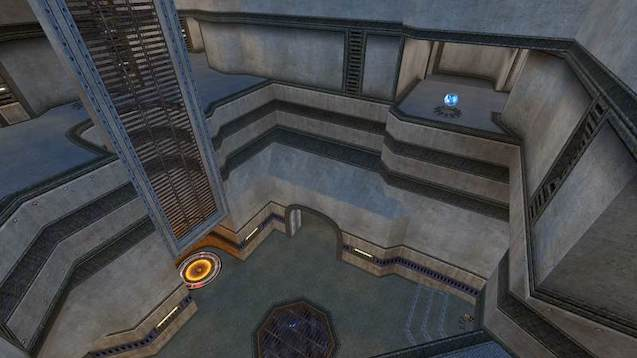

### The Chastity Belt Duel

https://steamcommunity.com/sharedfiles/filedetails/?id=579717457 - Map number 12  
https://ws.q3df.org/map/ospdm8a/  

### Lithium Flower ver.2

4 out of 5 (22 votes)

"Reviewing this release leaves me with a somewhat bittersweet taste in my mouth. I've jumped in a little late to the Q3A mapping scene and I'm sad to see that this is to be NemiX's last for Q3. I wish I'd come along sooner to see his craft progress in real time.
Sentimental stuff aside, this is one of the best industrial-themed maps I've had the pleasure to play. This map contains many tight corridors, multiple levels of play and some very unsuspecting pass-throughs for candid shots on unsuspecting victims. The amount of visual detail in this is amazing, and is complimented with a very fluid gameplay. Bots didn't seem to get hung up anywhere and proved an entertaining challenge on more difficult settings. I estimate that 6 human players would be max capacity on this map.
This map is solid, beautifully crafted, and offers some tight gameplay. Grab it now!" lvlworld

https://steamcommunity.com/sharedfiles/filedetails/?id=579717457 - Map number 18  
http://ws.q3df.org/map/q3nem06_v2/  
https://lvlworld.com/review/id:1904  
Live View: https://lvlworld.com/liveView/review/1904  

### Proving Grounds

https://steamcommunity.com/sharedfiles/filedetails/?id=579717457 - Map number 19  

### Last Trip

4.5 out of 5 (20 votes)

"Last Trip by Rota is a large and very vertical map. The floor plan is quite nice to see considering map layouts like this are not made very often. It completely has it's own feel, and the connectivity within it is astounding considering the side of the map. The author recommends that it works in tourney, but I do not agree unless your a person that likes to spend a half an hour looking for your opponent. I played FFA with five others and it works out nicely, though small team games also work well. I personally found a lot of the stairway set-ups to be very nice to look at, and the item and weapon layout seem balanced.
The stairways have a flat ramp edge to them, so if you play with promode enabled in OSP/CPMA you can move through the map at some nice speeds. Bots play fine. Textures from Sock." lvlworld

https://steamcommunity.com/sharedfiles/filedetails/?id=579717457 - Map number 21  
https://ws.q3df.org/map/rota3dm1/  
https://lvlworld.com/review/id:1913  
Live View: https://lvlworld.com/liveView/review/1913  

### KARIN

4.4 out of 5 (41 votes)

"KARIN by rota is a medium-sized FFA-map in a modern tech theme that makes excellent use of textures made by Sock, Speedy and Evillair. The architecture also looks very refreshing and goes well with the silver and blue textures, creating the dense atmosphere of fast fighting in a future space station or starship. The map is made up of three height levels connected via jumppads and stairs that allow for lots of intense vertical action, especially due to the arena-style of the map. Item placement is well done in general, though the lower level could maybe use a stronger reason to travel there.
It may take you a few seconds to figure out where you are after respawning in the beginning because all three levels look very similar, but this is a very minor issue. Bots play well and grab everything available on the map.
This map is a great piece of work that FFA players should get immediately - and they'll keep it. Even if you're not that into FFA, give this one a try and enjoy its atmosphere!" lvlworld

https://steamcommunity.com/sharedfiles/filedetails/?id=579717457 - Map number 22  
https://ws.q3df.org/map/rota3dm2/  
https://lvlworld.com/review/id:1941  
Live View: https://lvlworld.com/liveView/review/1941  

### Adelline

4.3 out of 5 (23 votes)

"A fast paced DM and smooth Tourney level over two floors. The layout twists and turns over all over the place and allow for some good connectivity. Visually there is noting wrong but some more variety in the texturing and lighting would have been nice. As it is you feel a bit like you are running around in a very large abandoned bathroom.
Tourney games are intense and can be very exciting with players working out where, and how well armed each other is. The item balance is very good. The RA placement can lead to surprises and you need to make sure your opponent is not guarding it.
DM matches are fast and a lot of fun. The entire map is used in both game modes as well. What more could you want from a DM?
Bots will put up a good fight and use the whole level, but will not go for the RA often.
Well worth grabbing for small DM or Tourney matches. A little more visually difference between upper and lower levels would have finished the map off better." lvlworld

https://steamcommunity.com/sharedfiles/filedetails/?id=579717457 - Map number 23  
https://ws.q3df.org/map/rota3tourney1/  
https://lvlworld.com/review/id:2041  
Live View: https://lvlworld.com/liveView/review/2041  

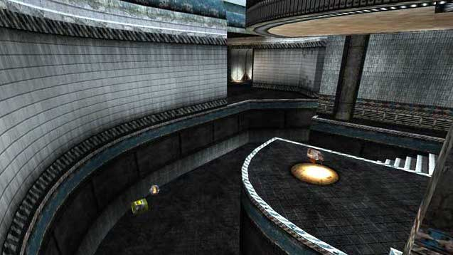