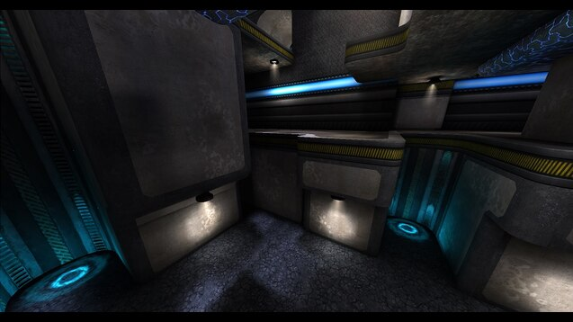
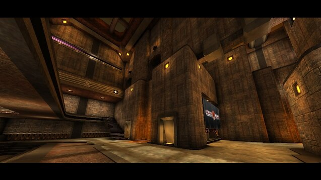

# Duel maps

This Workshop item list collects all duel maps.

## Based on

https://github.com/quakelive-server-standards/quakelive-server-standards/tree/ece697d788277555bb6f008c18d8734c57faeef4/workshop/standard/duel  

## Version 1

### Added

#### 540937824

https://steamcommunity.com/sharedfiles/filedetails/?id=540937824  

##### Cage

In-game name: `cage`  

#### 569873334

https://steamcommunity.com/sharedfiles/filedetails/?id=569873334  

##### Aggressor

In-game name: `aggressor`  
https://ws.q3df.org/map/aggressor  

#### 563655427

https://steamcommunity.com/sharedfiles/filedetails/?id=563655427  

##### The Rage

The Rage is a remake of ztn2dm3, which is a map that was made by Sten "ztn" Uusvali for Q2.

In-game name: `therage`  
https://ws.q3df.org/map/fora_rage/  
https://lvlworld.com/overview/id:1955  

#### 571945871

https://steamcommunity.com/sharedfiles/filedetails/?id=571945871  

##### Reloaded

A very Quake2 DM styled map with great connectivity, texturing and lighting.

In-game name: `yog3dm2`  
https://ws.q3df.org/map/yog3dm2/  
https://lvlworld.com/overview/id:585  

#### 579717457

https://steamcommunity.com/sharedfiles/filedetails/?id=579717457  

##### Adelline

In-game name: `rota3tourney1`  
https://ws.q3df.org/map/rota3tourney1/  
https://lvlworld.com/overview/id:2041  

##### Earth Core Program

In-game name: `fjo3tourney1`  
https://lvlworld.com/overview/id:2425  

##### KARIN

In-game name: `rota3dm2`  
https://ws.q3df.org/map/rota3dm2/  
https://lvlworld.com/overview/id:1941  

##### Last Trip

In-game name: `rota3dm1`  
https://ws.q3df.org/map/rota3dm1/  
https://lvlworld.com/overview/id:1913  

##### Lithium Flower ver.2

In-game name: `q3nem06_v2`  
https://ws.q3df.org/map/q3nem06_v2/  
https://lvlworld.com/overview/id:1904  

##### megadm4_09

In-game name: `megadm4_09`  
https://www.youtube.com/watch?v=yl69wqaIbaM  

##### Never Enough

In-game name: `ne_duel`  
https://ws.q3df.org/map/ne_duel/  
https://lvlworld.com/overview/id:1613  

##### Still Alive

A map that is focused on promode gameplay.

In-game name: `reqtourney1`  
https://ws.q3df.org/map/reqtourney1/  
https://lvlworld.com/media/id:2009  

##### Story to tell

In-game name: `necro6`  
https://ws.q3df.org/map/necro6/  
https://lvlworld.com/overview/id:1832  

#### 583405286

https://steamcommunity.com/sharedfiles/filedetails/?id=583405286  

##### Kora

In-game name: `rota3dm5`  
https://ws.q3df.org/map/rota3dm5/  
https://lvlworld.com/overview/id:2306  

#### 774562650

https://steamcommunity.com/sharedfiles/filedetails/?id=774562650  

##### Nemesis

The Map has its unique style with lots of cool angles and jumps.
In-game name: `nemesis`  

#### 856142431

https://steamcommunity.com/sharedfiles/filedetails/?id=856142431  

##### Kamasutra

In-game name: `kamasutra`  
https://ws.q3df.org/map/pukka3tourney6/  
https://lvlworld.com/overview/id:2058  

#### 863262235

https://steamcommunity.com/sharedfiles/filedetails/?id=863262235  

##### Khaooohs

An impressive map that blends a little of the tech textures with the gothic textures really well.

In-game name: `kaos`  
https://en.ws.q3df.org/map/kaos/  
https://lvlworld.com/overview/id:49  

#### 1209601964

https://steamcommunity.com/sharedfiles/filedetails/?id=1209601964  

##### Catharsis (Alpha 1)

Small-to-medium sized duel-oriented arena, based on an Warsow map.

In-game name: `catharsis_a1`  

#### 1691279416

https://steamcommunity.com/sharedfiles/filedetails/?id=1691279416  

##### Blood Covenant

QC map ported to QL with some additional fixes, and more fixes.

In-game name: `bloodcovenant`  
https://ws.q3df.org/map/bloodcovenant/  

#### 1693961293

https://steamcommunity.com/sharedfiles/filedetails/?id=1693961293  

##### Saint Tourney 1

This is a single arena area constructed on two levels.

In-game name: `sainttourney1`  
https://ws.q3df.org/map/sainttourney1/  
https://lvlworld.com/overview/id:1693  

#### 1706161905

https://steamcommunity.com/sharedfiles/filedetails/?id=1706161905  

##### Subversive Tendencies

In-game name: `teqtrny3`  
https://ws.q3df.org/map/teqtrny3/  
https://lvlworld.com/overview/id:944  

#### 1706214273

https://steamcommunity.com/sharedfiles/filedetails/?id=1706214273  

##### Stranglehold

This is one small map with a lot going for it.

In-game name: `jaxtourney1`  
https://ws.q3df.org/map/jaxtourney1/  
https://lvlworld.com/overview/id:1160  

#### 1827809205

https://steamcommunity.com/sharedfiles/filedetails/?id=1827809205  

##### 5quid

In-game name: `charon3dm13`   
https://ws.q3df.org/map/charon3dm13/  
https://lvlworld.com/overview/id:1606  

#### 2009762538

https://steamcommunity.com/sharedfiles/filedetails/?id=2009762538  

##### Aero Blood Run

In-game name: `oxodm2`  
https://ws.q3df.org/map/oxodm2/  
https://lvlworld.com/overview/id:2229  

#### 2020820722

https://steamcommunity.com/sharedfiles/filedetails/?id=2020820722  

##### Eldister

Eldister - remake of 'Elder' with 'Sinister' theme.

In-game name: `eldister`  

#### 2047343265

https://steamcommunity.com/sharedfiles/filedetails/?id=2047343265  

##### Si'Metrik

A temple floating in the sky above an archipelago of islands.

In-game name: `simetrik`  
https://ws.q3df.org/map/simetrik/  
https://lvlworld.com/overview/id:607  

#### 2056321023

https://steamcommunity.com/sharedfiles/filedetails/?id=2056321023  

##### Diabotical: Frontier

In-game name: `dbtfrontier`  

#### 2089014512

https://steamcommunity.com/sharedfiles/filedetails/?id=2089014512  

##### Harder Than Hate

In-game name: `pjw3tourney2`  
https://ws.q3df.org/map/pjw3tourney2/  
https://lvlworld.com/overview/id:1275  

#### 2099209867

https://steamcommunity.com/sharedfiles/filedetails/?id=2099209867  

##### Bastet

Small/Mid sized duel map.

In-game name: `bastet`  

#### 2310495629

https://steamcommunity.com/sharedfiles/filedetails/?id=2310495629  

##### Blood Run Tribute

In-game name: `bloodruntribute`  
https://ws.q3df.org/map/obs3dm2/  
https://lvlworld.com/overview/id:2028  

#### 2351045272

https://steamcommunity.com/sharedfiles/filedetails/?id=2351045272  

##### Blue Monk

In-game name: `bluemonk`  

#### 2351050532

https://steamcommunity.com/sharedfiles/filedetails/?id=2351050532  

##### Swift

In-game name: `swift`  

#### 2439697217

https://steamcommunity.com/sharedfiles/filedetails/?id=2439697217  

##### Imaginations from the other side

A ported version of the quake 1 map 'Imaginations from the other side' (gomdm3).

In-game name: `gmdm3`  

#### 542684362

https://steamcommunity.com/sharedfiles/filedetails/?id=542684362  

##### Monsoon

Lukin's Monsoon (xtn remix) ported to the new version of QL.

In-game name: `monsoon_converted`  
https://ws.q3df.org/map/monsoon/  

#### 547937675

https://steamcommunity.com/sharedfiles/filedetails/?id=547937675  

##### Beatbox

A good solid map that keeps you on your toes.

In-game name: `beatbox`  
https://ws.q3df.org/map/ztn3dm2/  
https://lvlworld.com/overview/id:107  

#### 579717457

https://steamcommunity.com/sharedfiles/filedetails/?id=579717457  

##### The Chastity Belt Duel

In-game name: `ospdm8a`  
https://ws.q3df.org/map/ospdm8a/  

##### Proving Grounds

In-game name: `q3tourney2`  

#### 641459594

https://steamcommunity.com/sharedfiles/filedetails/?id=641459594  

##### Placebo Effect

In-game name: `placeboeffect`  

#### 648343575

https://steamcommunity.com/sharedfiles/filedetails/?id=648343575  

##### Sinister (2012)

The first version of "Sinister" out of 2012 (Premium pak 14).

In-game name: `sinister2012`  

#### 821675354

https://steamcommunity.com/sharedfiles/filedetails/?id=821675354  

##### The Proving Grounds II

The Proving Grounds II (pro-q3tourney2) - converted, remixed and optimized for Quake Live.

In-game name: `prot2`  
https://ws.q3df.org/map/pro-q3tourney2/  

#### 822833735

https://steamcommunity.com/sharedfiles/filedetails/?id=822833735  

##### Totally Lost

Totally Lost (pro-nodm9) - converted from Q3A and optimized for Quake Live.

In-game name: `totallylost`  
https://ws.q3df.org/map/nodm9/  

#### 1927054766

https://steamcommunity.com/sharedfiles/filedetails/?id=1927054766  

##### BallsDeep

Ingame name: `ballsdeep`

#### 1976370267

https://steamcommunity.com/sharedfiles/filedetails/?id=1976370267  

##### CampKill

Ingame name: `campkill`
