# Duel maps

This Workshop item list collects all duel maps.

## Based on

https://github.com/quakelive-server-standards/quakelive-server-standards/tree/ece697d788277555bb6f008c18d8734c57faeef4/workshop/standard/duel  

## Evolutions

#### `540937824` Cage

https://steamcommunity.com/sharedfiles/filedetails/?id=540937824  

##### Cage

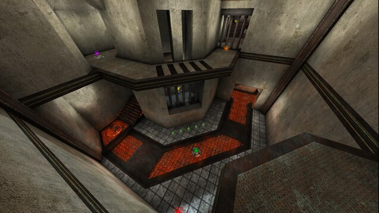

In-game name: `cage`  

#### `542684362` MONSOON_CONVERTED

https://steamcommunity.com/sharedfiles/filedetails/?id=542684362  

##### Monsoon

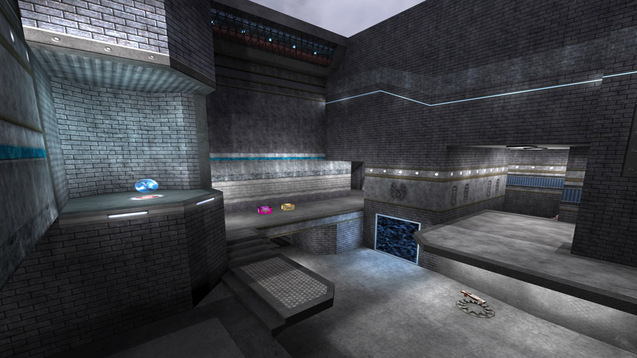

Lukin's Monsoon (xtn remix) ported to the new version of QL.

In-game name: `monsoon_converted`  
https://ws.q3df.org/map/monsoon/  

#### `547937675` Beatbox Map (ztn3dm2)

https://steamcommunity.com/sharedfiles/filedetails/?id=547937675  

##### Beatbox

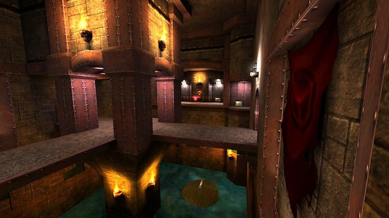

A good solid map that keeps you on your toes.

In-game name: `beatbox`  
https://ws.q3df.org/map/ztn3dm2/  
https://lvlworld.com/overview/id:107  

#### `563655427` The Rage

https://steamcommunity.com/sharedfiles/filedetails/?id=563655427  

##### The Rage

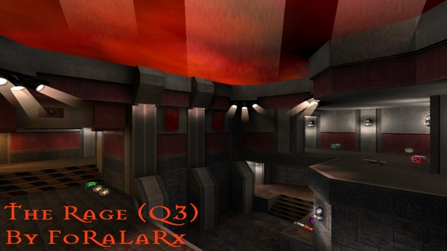

The Rage is a remake of ztn2dm3, which is a map that was made by Sten "ztn" Uusvali for Q2.

In-game name: `therage`  
https://ws.q3df.org/map/fora_rage/  
https://lvlworld.com/overview/id:1955  

#### `569873334` Aggressor

https://steamcommunity.com/sharedfiles/filedetails/?id=569873334  

##### Aggressor

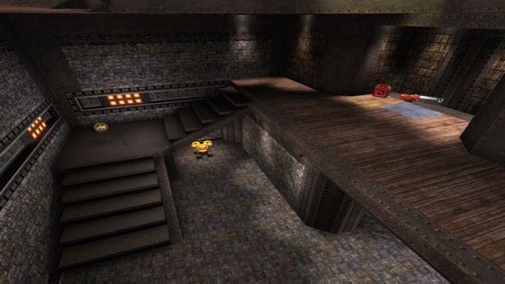

In-game name: `aggressor`  
https://ws.q3df.org/map/aggressor  

#### `571945871` Reloaded by Yogi

https://steamcommunity.com/sharedfiles/filedetails/?id=571945871  

##### Reloaded

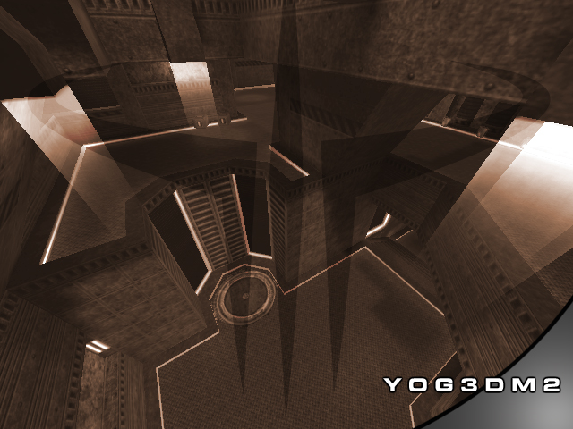

A very Quake2 DM styled map with great connectivity, texturing and lighting.

In-game name: `yog3dm2`  
https://ws.q3df.org/map/yog3dm2/  
https://lvlworld.com/overview/id:585  

#### `579717457` Quake Live Extra Duel Maps

https://steamcommunity.com/sharedfiles/filedetails/?id=579717457  

##### Adelline

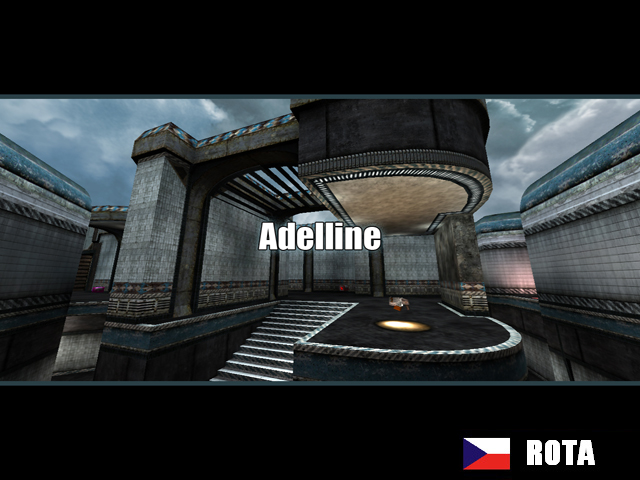

In-game name: `rota3tourney1`  
https://ws.q3df.org/map/rota3tourney1/  
https://lvlworld.com/overview/id:2041  

##### Earth Core Program

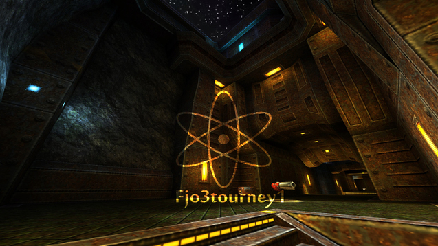

In-game name: `fjo3tourney1`  
https://lvlworld.com/overview/id:2425  

##### KARIN

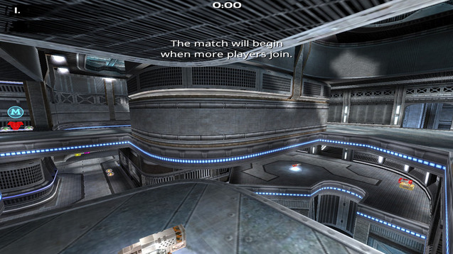

In-game name: `rota3dm2`  
https://ws.q3df.org/map/rota3dm2/  
https://lvlworld.com/overview/id:1941  

##### Last Trip

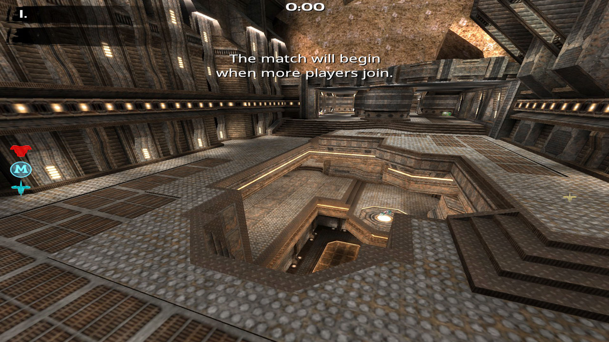

In-game name: `rota3dm1`  
https://ws.q3df.org/map/rota3dm1/  
https://lvlworld.com/overview/id:1913  

##### Lithium Flower ver.2

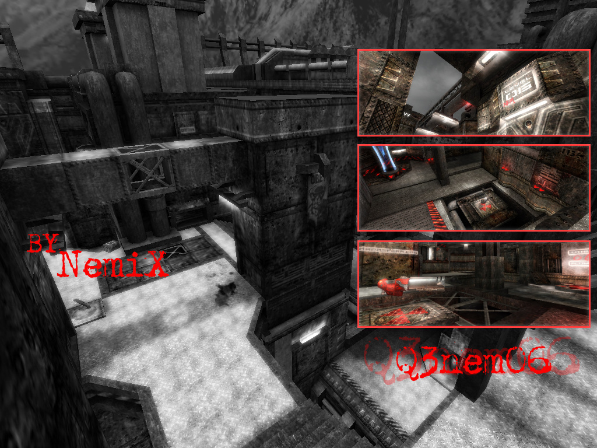

In-game name: `q3nem06_v2`  
https://ws.q3df.org/map/q3nem06_v2/  
https://lvlworld.com/overview/id:1904  

##### megadm4_09

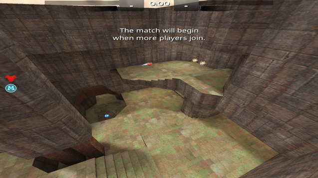

In-game name: `megadm4_09`  
https://www.youtube.com/watch?v=yl69wqaIbaM  

##### Never Enough

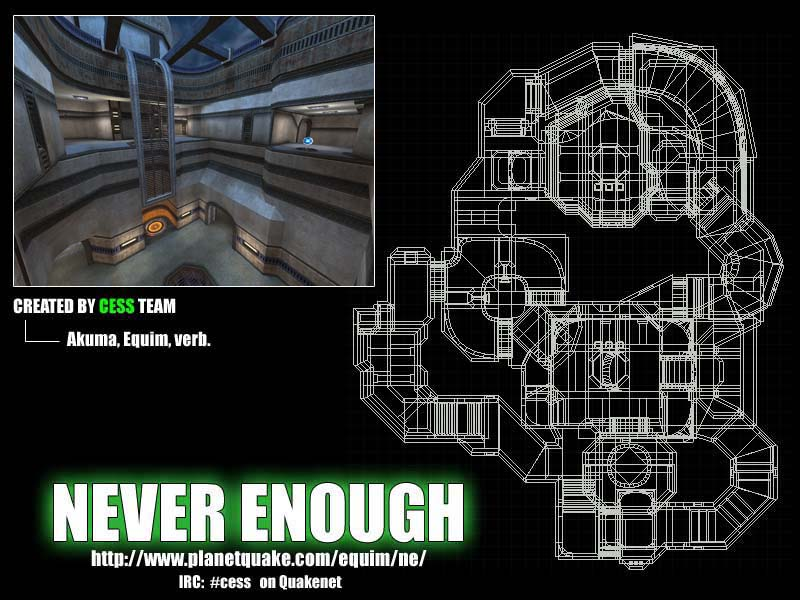

In-game name: `ne_duel`  
https://ws.q3df.org/map/ne_duel/  
https://lvlworld.com/overview/id:1613  

##### Proving Grounds

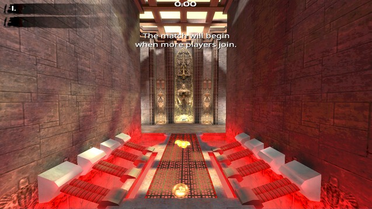

In-game name: `q3tourney2`  

##### Still Alive

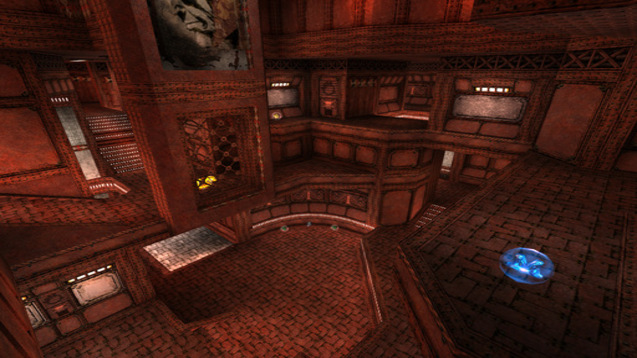

A map that is focused on promode gameplay.

In-game name: `reqtourney1`  
https://ws.q3df.org/map/reqtourney1/  
https://lvlworld.com/media/id:2009  

##### Story to tell

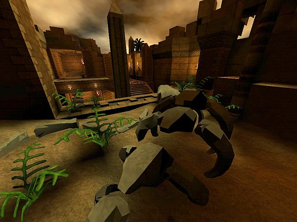

In-game name: `necro6`  
https://ws.q3df.org/map/necro6/  
https://lvlworld.com/overview/id:1832  

##### The Chastity Belt Duel

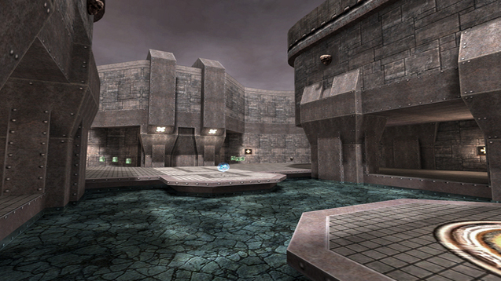

In-game name: `ospdm8a`  
https://ws.q3df.org/map/ospdm8a/  

#### `583405286` Kora

https://steamcommunity.com/sharedfiles/filedetails/?id=583405286  

##### Kora

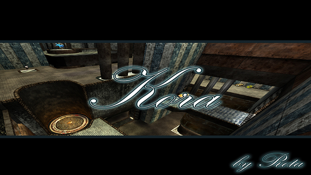

In-game name: `rota3dm5`  
https://ws.q3df.org/map/rota3dm5/  
https://lvlworld.com/overview/id:2306  

#### `641459594` Placebo Effect

https://steamcommunity.com/sharedfiles/filedetails/?id=641459594  

##### Placebo Effect

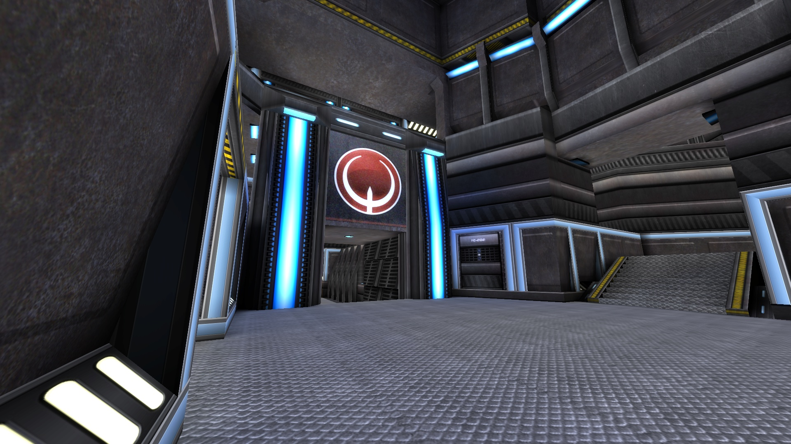

In-game name: `placeboeffect`  

#### `648343575` Sinister (2012)

https://steamcommunity.com/sharedfiles/filedetails/?id=648343575  

##### Sinister 2012

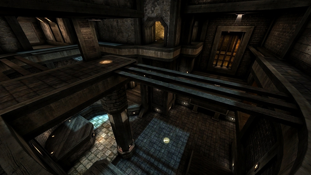

The first version of "Sinister" out of 2012 (Premium pak 14).

In-game name: `sinister2012`  

#### `774562650` Duel Map Nemesis

https://steamcommunity.com/sharedfiles/filedetails/?id=774562650  

##### Nemesis

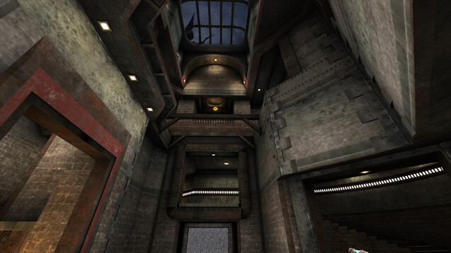

The Map has its unique style with lots of cool angles and jumps.
In-game name: `nemesis`  

#### `821675354` The Proving Grounds II

https://steamcommunity.com/sharedfiles/filedetails/?id=821675354  

##### The Proving Grounds II

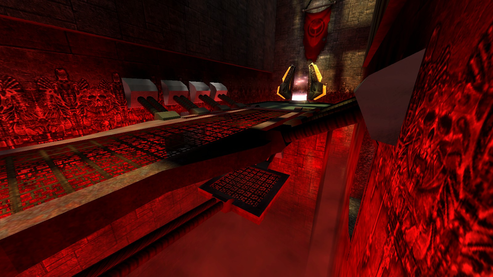

The Proving Grounds II (pro-q3tourney2) - converted, remixed and optimized for Quake Live.

In-game name: `prot2`  
https://ws.q3df.org/map/pro-q3tourney2/  

#### `822833735` Totally Lost

https://steamcommunity.com/sharedfiles/filedetails/?id=822833735  

##### Totally Lost

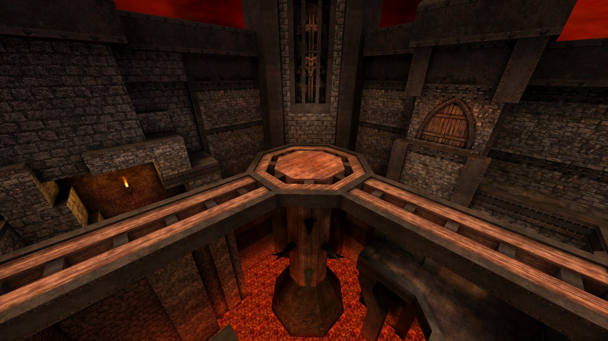

Totally Lost (pro-nodm9) - converted from Q3A and optimized for Quake Live.

In-game name: `totallylost`  
https://ws.q3df.org/map/nodm9/  

#### `856142431` Kamasutra

https://steamcommunity.com/sharedfiles/filedetails/?id=856142431  

##### Kamasutra

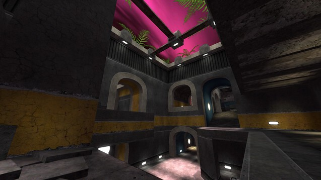

In-game name: `kamasutra`  
https://ws.q3df.org/map/pukka3tourney6/  
https://lvlworld.com/overview/id:2058  

#### `863262235` Khaooohs

https://steamcommunity.com/sharedfiles/filedetails/?id=863262235  

##### Kaos

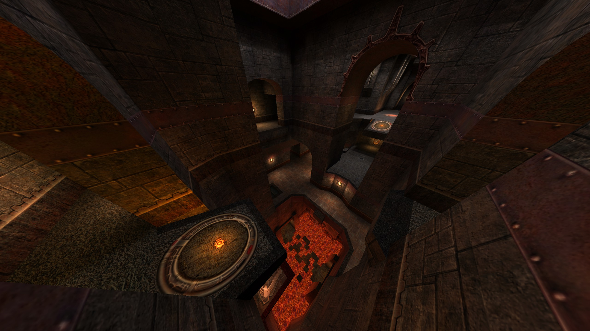

An impressive map that blends a little of the tech textures with the gothic textures really well.

In-game name: `kaos`  
https://en.ws.q3df.org/map/kaos/  
https://lvlworld.com/overview/id:49  

#### `1209601964` Catharsis (Alpha 1)

https://steamcommunity.com/sharedfiles/filedetails/?id=1209601964  

##### Catharsis Alpha 1

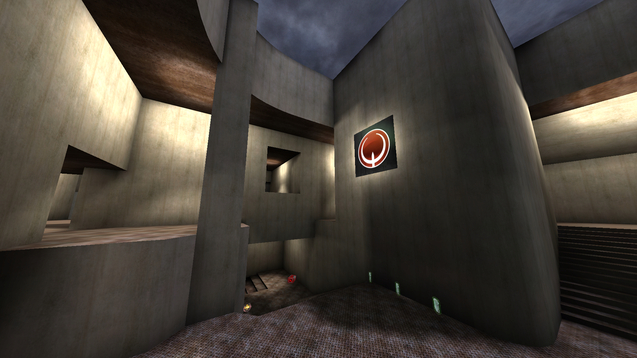

Small-to-medium sized duel-oriented arena, based on an Warsow map.

In-game name: `catharsis_a1`  

#### `1691279416` Blood Covenant

https://steamcommunity.com/sharedfiles/filedetails/?id=1691279416  

##### Blood Covenant

QC map ported to QL with some additional fixes, and more fixes.

In-game name: `bloodcovenant`  
https://ws.q3df.org/map/bloodcovenant/  

#### `1693961293` sainttourney1 - Saint Tourney 1

https://steamcommunity.com/sharedfiles/filedetails/?id=1693961293  

##### Saint Tourney 1

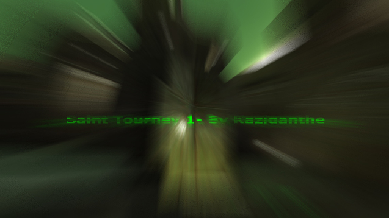

This is a single arena area constructed on two levels.

In-game name: `sainttourney1`  
https://ws.q3df.org/map/sainttourney1/  
https://lvlworld.com/overview/id:1693  

#### `1706161905` teqtrny3 - subversive tendencies

https://steamcommunity.com/sharedfiles/filedetails/?id=1706161905  

##### Subversive Tendencies

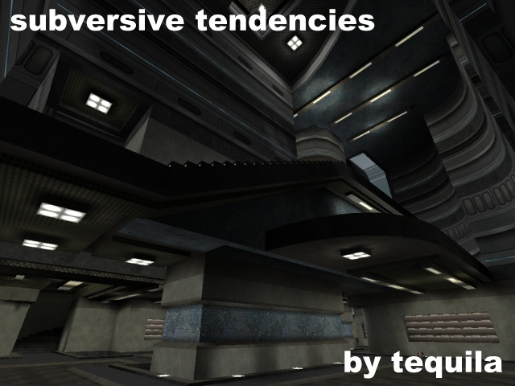

In-game name: `teqtrny3`  
https://ws.q3df.org/map/teqtrny3/  
https://lvlworld.com/overview/id:944  

#### `1706214273` jaxtourney1 - Stranglehold

https://steamcommunity.com/sharedfiles/filedetails/?id=1706214273  

##### Stranglehold

This is one small map with a lot going for it.

In-game name: `jaxtourney1`  
https://ws.q3df.org/map/jaxtourney1/  
https://lvlworld.com/overview/id:1160  

#### `1827809205` charon3dm13 - 5quid

https://steamcommunity.com/sharedfiles/filedetails/?id=1827809205  

##### 5quid

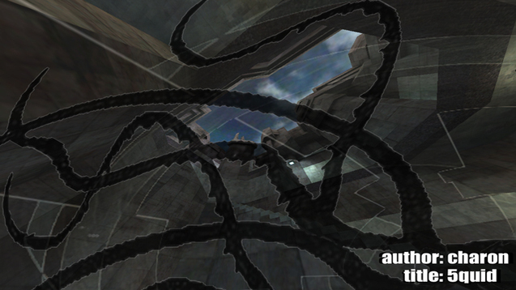

In-game name: `charon3dm13`   
https://ws.q3df.org/map/charon3dm13/  
https://lvlworld.com/overview/id:1606  

#### `2009762538` Aero Blood Run

https://steamcommunity.com/sharedfiles/filedetails/?id=2009762538  

##### Aero Blood Run

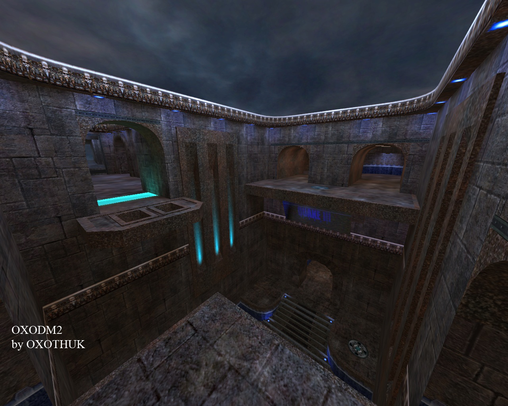

In-game name: `oxodm2`  
https://ws.q3df.org/map/oxodm2/  
https://lvlworld.com/overview/id:2229  

#### `2020820722` Eldister

https://steamcommunity.com/sharedfiles/filedetails/?id=2020820722  

##### Eldister

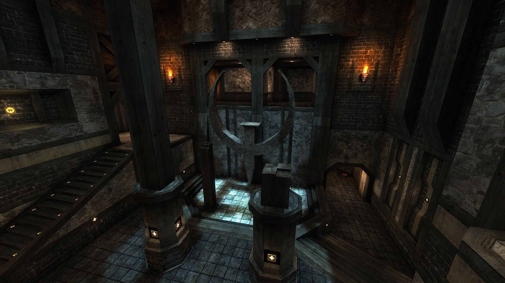

Eldister - remake of 'Elder' with 'Sinister' theme.

In-game name: `eldister`  

#### `2047343265` Si'Metrik

https://steamcommunity.com/sharedfiles/filedetails/?id=2047343265  

##### Si'Metrik

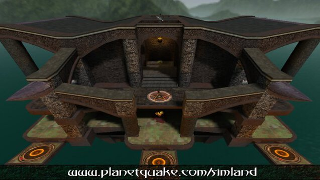

A temple floating in the sky above an archipelago of islands.

In-game name: `simetrik`  
https://ws.q3df.org/map/simetrik/  
https://lvlworld.com/overview/id:607  

#### `2056321023` Diabotical: Frontier

https://steamcommunity.com/sharedfiles/filedetails/?id=2056321023  

##### Diabotical Frontier

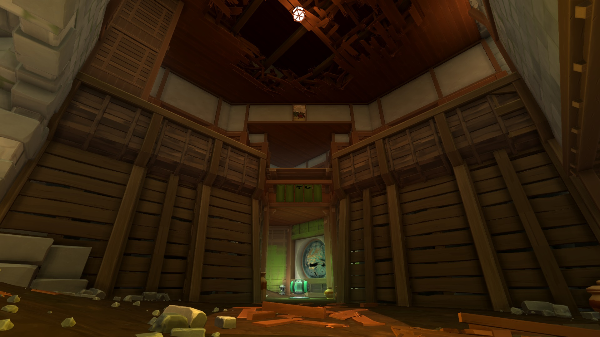

In-game name: `dbtfrontier`  

#### `2089014512` Harder Than Hate

https://steamcommunity.com/sharedfiles/filedetails/?id=2089014512  

##### Harder Than Hate

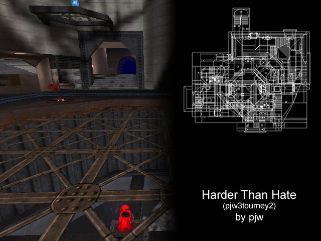

In-game name: `pjw3tourney2`  
https://ws.q3df.org/map/pjw3tourney2/  
https://lvlworld.com/overview/id:1275  

#### `2099209867` Bastet (2020 Duel map)

https://steamcommunity.com/sharedfiles/filedetails/?id=2099209867  

##### Bastet

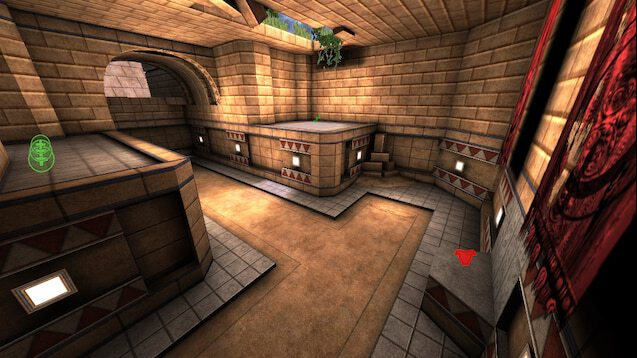

Small/Mid sized duel map.

In-game name: `bastet`  

#### `2310495629` Blood Run Tribute

https://steamcommunity.com/sharedfiles/filedetails/?id=2310495629  

##### Blood Run Tribute

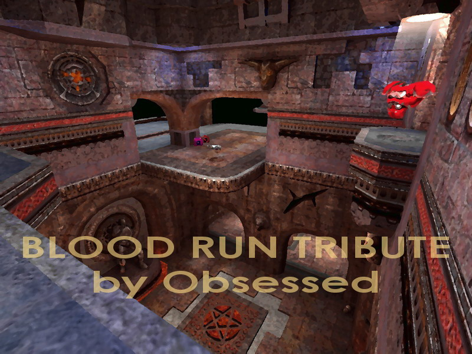

In-game name: `bloodruntribute`  
https://ws.q3df.org/map/obs3dm2/  
https://lvlworld.com/overview/id:2028  

#### `2351045272` bluemonk

https://steamcommunity.com/sharedfiles/filedetails/?id=2351045272  

##### Blue Monk

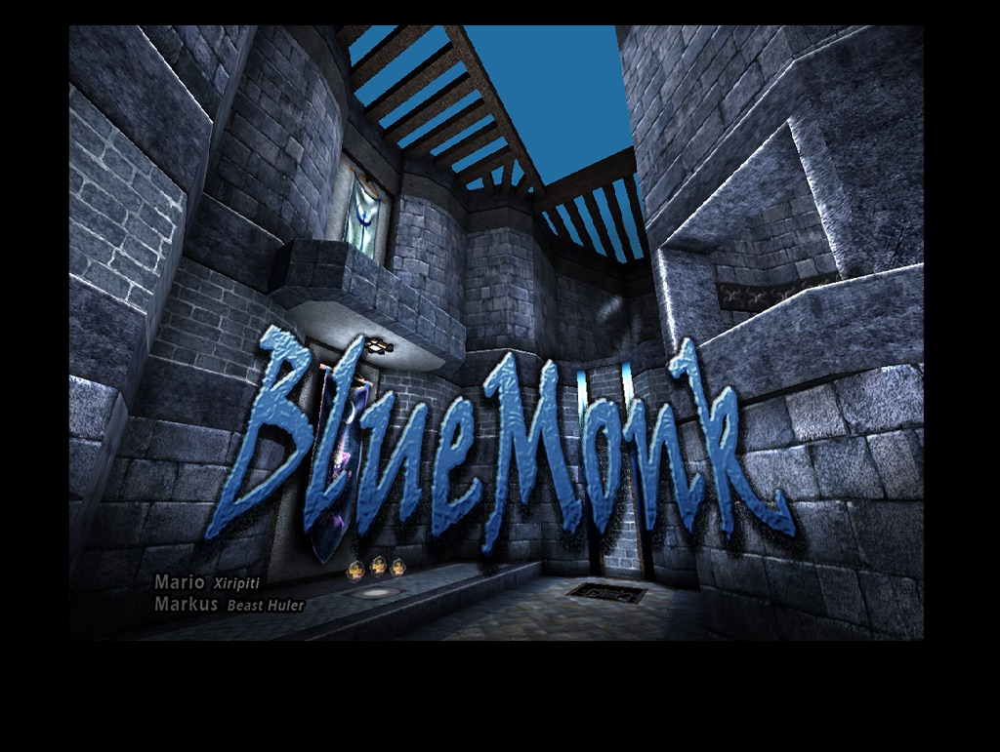

In-game name: `bluemonk`  

#### `2351050532` swift

https://steamcommunity.com/sharedfiles/filedetails/?id=2351050532  

##### Swift

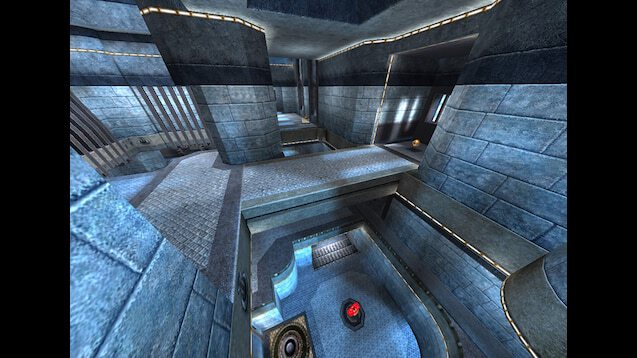

In-game name: `swift`  

#### `2439697217` gomdm3

https://steamcommunity.com/sharedfiles/filedetails/?id=2439697217  

##### Imaginations from the other side

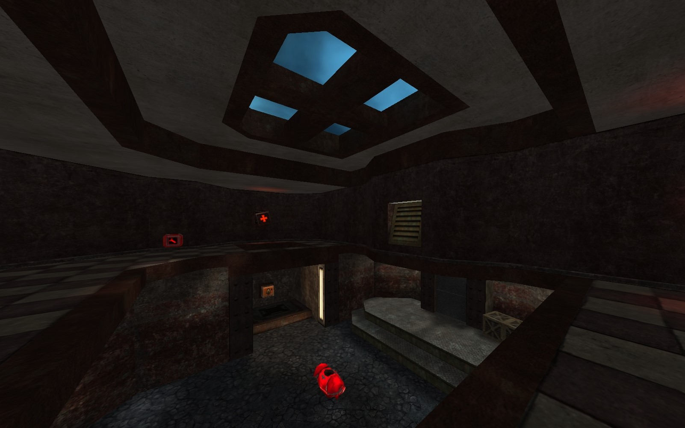

A ported version of the quake 1 map 'Imaginations from the other side' (gomdm3).

In-game name: `gmdm3`  

#### `1927054766` BallsDeep

https://steamcommunity.com/sharedfiles/filedetails/?id=1927054766  

##### Balls Deep

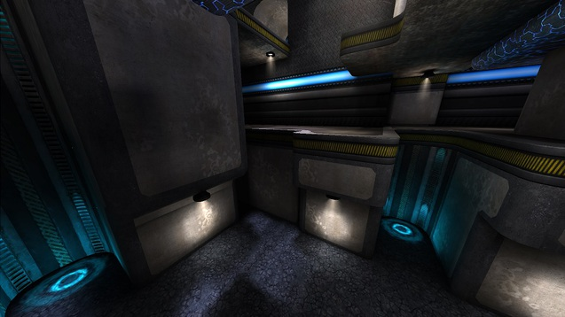

Ingame name: `ballsdeep`

#### `1976370267` CampKill

https://steamcommunity.com/sharedfiles/filedetails/?id=1976370267  

##### Camp Kill

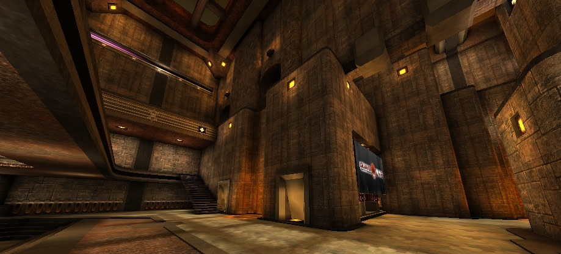

Ingame name: `campkill`

## History

### Version 1

- **Add:** `540937824` Cage
- **Add:** `542684362` MONSOON_CONVERTED
- **Add:** `547937675` Beatbox Map (ztn3dm2)
- **Add:** `563655427` The Rage
- **Add:** `569873334` Aggressor
- **Add:** `571945871` Reloaded by Yogi
- **Add:** `579717457` Quake Live Extra Duel Maps
- **Add:** `583405286` Kora
- **Add:** `641459594` Placebo Effect
- **Add:** `648343575` Sinister (2012)
- **Add:** `774562650` Duel Map Nemesis
- **Add:** `821675354` The Proving Grounds II
- **Add:** `822833735` Totally Lost
- **Add:** `856142431` Kamasutra
- **Add:** `863262235` Khaooohs
- **Add:** `1209601964` Catharsis (Alpha 1)
- **Add:** `1691279416` Blood Covenant
- **Add:** `1693961293` sainttourney1 - Saint Tourney 1
- **Add:** `1706161905` teqtrny3 - subversive tendencies
- **Add:** `1706214273` jaxtourney1 - Stranglehold
- **Add:** `1827809205` charon3dm13 - 5quid
- **Add:** `2009762538` Aero Blood Run
- **Add:** `2020820722` Eldister
- **Add:** `2047343265` Si'Metrik
- **Add:** `2056321023` Diabotical: Frontier
- **Add:** `2089014512` Harder Than Hate
- **Add:** `2099209867` Bastet (2020 Duel map)
- **Add:** `2310495629` Blood Run Tribute
- **Add:** `2351045272` bluemonk
- **Add:** `2351050532` swift
- **Add:** `2439697217` gomdm3
- **Add:** `1927054766` BallsDeep
- **Add:** `1976370267` CampKill
